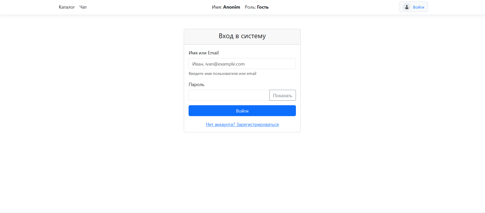
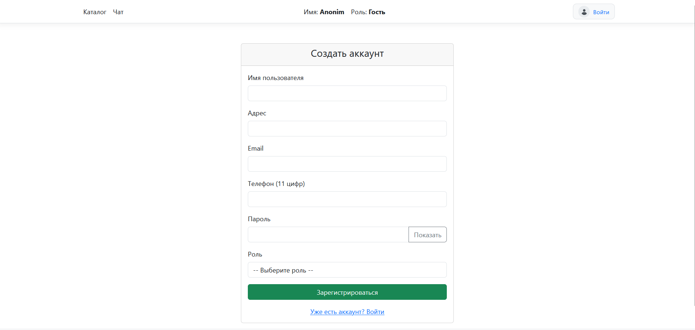
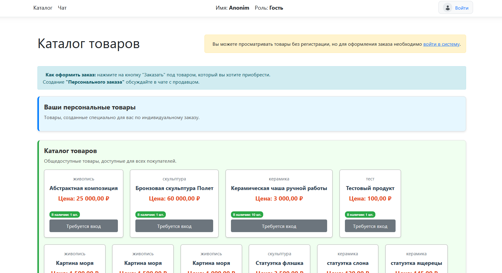
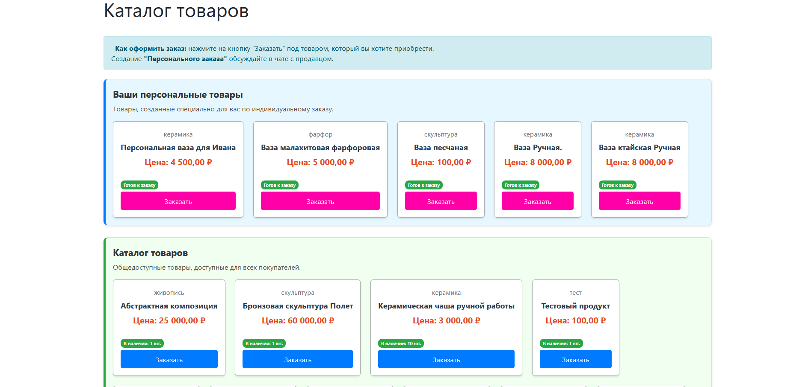
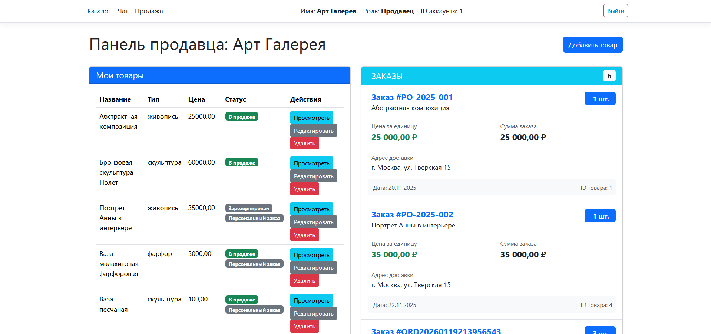

# РАЗРАБОТКА БД И ПРИЛОЖЕНИЯ ДЛЯ УЧЕТА ПРОДАЖИ ПРЕДМЕТОВ ИСКУССТВА
Описание компонентов технологии:

а) основные технологии
   - .NET Core / .NET – платформа для разработки;
   - 	ASP.NET Core – веб-фреймворк;

б) источник данных
   - PostgreSQL – система управления базами данных;

в) слой доступа к данным (компоненты доступа к данным):
  - Entity Framework Core – ORM для работы с БД;
  - Npgsql – ADO.NET драйвер для PostgreSQL;
  - папка Models с описанием форматов данных БД;

г) бизнес слой
   - бизнес процесс реализован в логике файлов .cs;
   - бизнес компоненты реализованы классами C#;
   - бизнес сущности реализованы в классах аккаунтов (Account), продуктов (Product), заказов (Purchase);

д) слой представления
   - компоненты UI реализованы HTML5/CSS3/JavaScript, Bootstrap;
   - компоненты процесса UI реализованы на Razor Pages (.cshtml, .cshtml.cs);

е) сквозная функциональность
   - безопасность реализована на ASP.NET Core Identity – аутентификация и авторизация, HTTPS/SSL – шифрование трафика;
   - операционное управление реализована доступом администратора к данным на всех таблицах БД;
   - связь реализована Async/Await - асинхронная связь между всеми слоями.

### Вход в систему

### Регистрация

### Каталог без входа

### Интерфейс покупателя

### Интерфейс продовца

